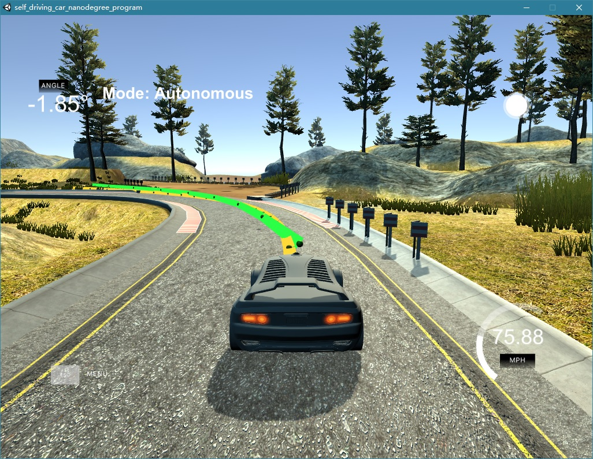
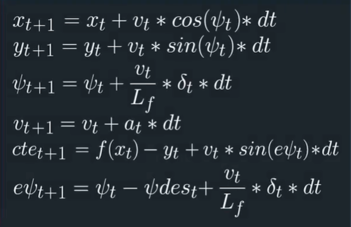

# **Model Predictive Control (MPC)**
Self-Driving Car Engineer Nanodegree Program

---

**Model Predictive Control  Project**

The goals / steps of this project are the following:
* Implement a Model Predictive Controller (MPC) that controls the steering of a car in the simulator
* Test that the controler successfully drives around the track without leaving the road
* Summarize the results with a report



## Rubric Points
### Here I will consider the [rubric points](https://review.udacity.com/#!/rubrics/896/view) individually and describe how I addressed each point in my implementation.  

---
### Compilation

#### 1. Code must compile without errors with `cmake` and `make`.

My project includes the following files:
* src/main.cpp main source file containig the main loop
* src/MPC.cpp source file for the MPC Controller class
* src/MPC.h header file for the MPC Controller class
* src/json.hpp library for handling json


### Implementation

#### 1. Student describes their model in detail. This includes the state, actuators and update equations.

My model is the same as described in the lessons:
![alt text][image1]

The state is made of:
* x - The global x position of the vehicle
* y - The global y position of the vehicle.
* psi - The orientation of the vehicle in radians
* v - The current velocity in mph
* cte - Cross track error
* epsi - Psi error

The actuators are:
* delta - steering angle
* a - throttle

For the update equations see the image.


#### 2. Student discusses the reasoning behind the chosen N (timestep length) and dt (elapsed duration between timesteps) values. Additionally the student details the previous values tried.

I chose 10 steps, with a duration between timesteps of 0.1s.
N is the number of future states we are predicting. N will be directly proportional to the computation time. Too many steps need too much time for computing. A shorter horizon tends to get instable in narrow bends. I have consideres values from 10 to 30 for N, I found that 10 was enough for N.
The value dt is the interval between two consecutive future states. So if dt is smaller we will be able to predict the states of the vehicle very accurately in near future. I have consideres values from 0.1 to 0.3 for dt, and found that 0.1 was the best for dt.

#### 3. If the student preprocesses waypoints, the vehicle state, and/or actuators prior to the MPC procedure it is described.

Prior to MPC, I converted the global coordinates ptsx and ptsy to vehicle's local coordinate waypoints_x and waypoints_y. Later I ran polyfit on waypoints to calculate coefficients of the 3rd-degree curve in which the car will be moving. Using these coefficients, I calculated the cross track error (cte) and the psi error (epsi). These errors are used to denote the state of the car ie (x, y, psi, v, cte, epsi)

#### 4. The student implements Model Predictive Control that handles a 100 millisecond latency. Student provides details on how they deal with latency.

For dealing with latency I am predicting the future state of the vehicle using the velocity of the car with the MPC equations. I added this logic as follows:

```
double Lf = 2.67;

// 100 ms delay
double latency = 100.00 / 1000;

v = v + throttle_value * latency;
psi = psi - v / Lf * steer_value * latency;
px = px + v * cos(psi) * latency;
py = py + v * sin(psi) * latency;
```

### Simulation

#### 1. The vehicle must successfully drive a lap around the track.

On my machine, the vehicle drived successfully around the lap.
